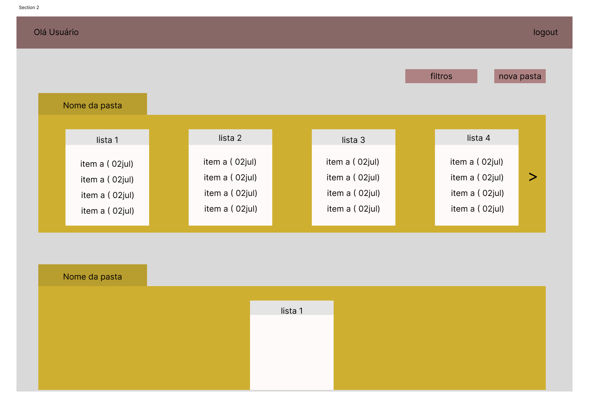

# ToDo List - Ruby on Rails

Aplicação web para gerenciamento de tarefas com múltiplos níveis (pastas, listas e tarefas), interface moderna, responsiva e deploy em produção via Fly.io.

## Tecnologias Utilizadas

- **Ruby** 3.2.8
- **Rails** 7.1.x
- **PostgreSQL** 15 (banco de dados)
- **Devise** (autenticação)
- **Turbo Streams** (atualização dinâmica)
- **Docker** e **Docker Compose** (ambiente e deploy)
- **Fly.io** (deploy em nuvem)
- **Stimulus** (JS leve para modais e interações)
- **I18n** (internacionalização para português)

## Funcionalidades

- Cadastro e login de usuários (Devise)
- Criação, edição e remoção de **pastas**
- Criação, edição e remoção de **listas** dentro de pastas
- Criação, edição, conclusão e remoção de **tarefas** dentro de listas
- Interface moderna, responsiva, com cards, modais e botões estilizados
- Atualização dinâmica de listas, pastas e tarefas (Turbo Streams)
- Filtros e ordenação de pastas/listas
- Navbar fixa com contagem de tarefas concluídas
- Internacionalização completa para português

## Como rodar localmente (Docker)

1. Instale Docker e Docker Compose
2. Rode:
   ```bash
   docker-compose build
   docker-compose up
   # Em outro terminal:
   docker-compose run web rails db:create db:migrate
   ```
3. Acesse [http://localhost:3000](http://localhost:3000)

## Deploy em produção

Deploy automatizado via Fly.io.

## Processo de Desenvolvimento

1. Primeiro estudei um pouco sobre a linguagem, a qual não havia contato antes
2. Depois iniciei o projeto e brinquei um pouco com os scaffolds e migrations
3. Com o conhecimento das possibilidades, modelei uma tela pelo figma:

4. Então comecei o desenvolvimento pela criação do usuário, utilizando o devise
5. Seguido pelas pastas, listas e tarefas que foram criados no banco
6. Optei em ter uma abordagem mais pessoal com o cliente e adicionei a possibilidade de um nome além do email
7. Estabelecido o back-end com regras de pastas, listas e tarefas pertencerem a usuários, comecei a organizar o front-end
8. Então desenvolvi a tela da forma que havia modelado e apliquei melhorias e alguns desvios
9. Conheci o Turbo streams, que faria a aplicação ser mais dinâmica ao editar, excluir e criar entidades.
10. Também gerei arquivos de tradução.
11. Em seguida criei a listagem por filtros.


Desenvolvido com ❤️ por [Alejandro](https://github.com/typedefAlejandro)
